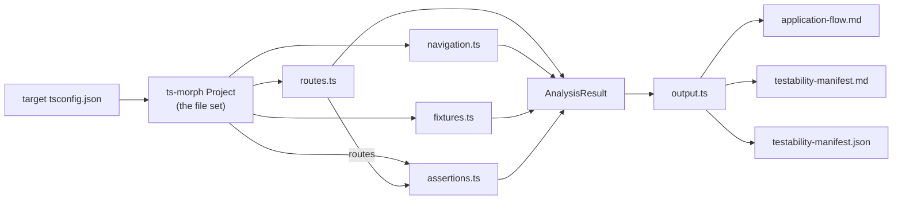

# flow-analyzer

A static analyzer that reads a React + React Router app and emits the material needed to
**write end-to-end Playwright tests without reading the application source**.

## What it is for

A navigation graph tells you where a user can go. It does not tell you what to click to get
there, what state the app has to be in first, or what to assert once you arrive. Those three
things are what a test is actually made of, and they are the reason a graph alone cannot
generate one.

`flow-analyzer` answers all three from the source, statically, and writes them down:

| Question a test generator must answer | Where the answer comes from |
|---|---|
| What do I click to traverse this edge? | a Playwright locator per navigation edge |
| What state must the app be in first? | route guards, gating `localStorage` keys, edge preconditions |
| What data do I need to exist? | seed-data fixtures with their real ids |
| What do I assert when I arrive? | headings, landmarks, and toast copy per route |

The target capability is: **hand a generator these artifacts and the source code is never
opened.** Everything below is in service of that.

## Requirements

- Node.js (developed and verified on v25.5.0)
- The analyzed project must have a `tsconfig.json` — the analyzer builds a ts-morph `Project`
  from it and follows the file set it declares
- `npm install` (dependencies: `ts-morph`, `fast-glob`; runner: `tsx`)

## Usage

```bash
cd flow-analyzer
npm install

npm run analyze                      # defaults to ../frontend
npm run analyze -- ../frontend       # explicit target
```

Output is written to the **current working directory**, so run it from `flow-analyzer/` to keep
the artifacts next to the tool. A successful run prints:

```
Analyzing: ./kangoo/frontend
Source files: 33 (scanned 32)
Routes: 9
Navigations: 25
Fixtures: 2
Route assertions: 9
App-level feedback: 4
Ambiguous locators: 0
```

`Source files` is two numbers because they come from two different places: ts-morph resolves its
set from the tsconfig `include`, while `scanSourceFiles` globs `src/**`. The gap is normal — in
this project it is `vite.config.ts`, which the tsconfig includes but the glob does not match. The
ts-morph number is the authoritative one; the scan is a diagnostic.

If the target has no `tsconfig.json`:

```
No tsconfig.json found at /tmp/does-not-exist/tsconfig.json
Usage: npm run analyze [path-to-project]
```

## Output

| Artifact | Audience | Contents |
|---|---|---|
| `application-flow.md` | humans | Pages, then every navigation edge with type, locator, condition and source |
| `testability-manifest.md` | humans | Routes, navigation edges, ambiguous locators, fixtures, per-route assertions, app-level feedback |
| `testability-manifest.json` | tools | The same result as a single `AnalysisResult` object — this is what a generator should consume |

All three are **generated**. Never hand-edit them; they are overwritten on every run. To change
what they say, change an analyzer.

`navigation-graph.md` in this directory is *not* produced by the tool — it is a hand-written
verification record from 2026-09-11 with deliberately stale line numbers, kept for the edge
inventory and findings. Treat the generated artifacts as authoritative.

## How it works



| Module | Detects | Emits |
|---|---|---|
| `analyzers/routes.ts` | `<Route>` declarations; resolves the component by descending through guard wrappers; follows guards to their store and reads the `persist` key | `Route[]` with `component`, `guards`, `stores` |
| `analyzers/navigation.ts` | `<Link to>`, `<Navigate to>`, `useNavigate()` calls — both self-closing and children forms; walks ancestors for the enclosing branch; builds a locator; second whole-project pass for collisions | `Navigation[]` with `locator`, `condition` |
| `analyzers/fixtures.ts` | exported arrays of object literals in the data modules | `Fixture[]` with `idField`, every `id`, a readable `sample` |
| `analyzers/assertions.ts` | `<h1>` per route, stable text runs, and the string literals passed to `toast.*()` — including the literal fallback arm of a logical-or or nullish-coalescing expression | `RouteAssertion[]`, plus app-level feedback |
| `output.ts` | — | renders the three artifacts |
| `types.ts` | — | the contract (see below) |
| `index.ts` | — | wires the pipeline, resolves the target, logs counts |
| `scanner.ts` | — | diagnostic file count only |

### The contract

`src/types.ts` is the **single interface** between the analyzers. Every analyzer imports its
output type from there and nothing else. The analyzers are independent of each other by design —
that is what makes them safe to develop or replace in parallel — and this file is the only thing
holding them together. Change a shape here and you must update every consumer.

### The design rule

**Prefer omitting a field to emitting a value that could mislead a generator.** A missing heading
costs a generator one assertion; a *wrong* heading or an unmatchable text fragment generates a
test that fails against a correct app, which is worse than no test. This is why, for example, a
route whose `<h1>` only exists inside a not-found branch reports no `heading` at all, and why a
prop-drilled edge reports no `locator` rather than an approximate one.

## What it cannot see

These are known limits, deliberately handled rather than papered over:

- **Prop-drilled navigation.** When `navigate()` lives in a parent handler but the button that
  invokes it lives in a child reached via a callback prop, ancestor-walking from the call site
  finds no clickable element. The edge is reported with no locator instead of a guess.
- **Interpolated text.** When JSX splits around an interpolation — `Itens ({count})` — the emitted
  landmark is the literal fragment `Itens (`, which still matches the rendered `Itens (3)` by
  Playwright's substring matching. The runs are never joined back into `Itens ()`, which would
  match nothing. Fragments that can match are kept; joins across an interpolation are not.
- **Toasts render in a portal**, outside the component tree, so they are not page content.
  They are surfaced separately as `transientFeedback` (per route) and `appLevelFeedback`
  (for `AuthModal` / `Header`, which belong to no route — authentication reports its outcome
  there and nowhere else). Assert them with `getByRole('status')`, scoped by
  `.filter({ hasText: ... })`, inside the 4000 ms window configured in `main.tsx`. No source
  change was needed for this: the role is applied by `react-hot-toast` itself.
- **Ambiguity is judged statically, across the whole project.** Two `data-testid`s reused in
  mutually exclusive render branches look like a collision even though they never co-render. The
  analyzer reports them rather than assuming; the frontend resolved the two real cases by renaming
  (`checkout-empty-back` / `checkout-back`, `orderdetail-notfound-back` / `orderdetail-back`).
- **No runtime knowledge.** `condition` is a static description of the branch an edge sits in. It
  says what *would* have to be true, not what is true in a given session.
- **React Router v6 shapes only.** The patterns it recognises are the ones named in the table
  above; a project using a different router or a custom navigation abstraction will produce
  partial output.

## Extending it

1. Add or change the type in `src/types.ts` **first** — it is the contract.
2. Implement in the relevant analyzer (or add one), importing the type from `../types.js`.
3. Verify:

   ```bash
   npx tsc --noEmit    # typecheck only
   npm run analyze     # regenerates the artifacts
   ```

Note the strict compiler settings in `tsconfig.json`, which are all on and all bite:
`exactOptionalPropertyTypes` (omit an optional key; never assign `undefined`), `verbatimModuleSyntax`
(use `import type`), and `noUncheckedIndexedAccess` (indexing yields `T | undefined`). This is an
ESM package: `"type": "module"` is required in `package.json`, and relative imports need a `.js`
extension even though the files are `.ts`.

## Layout

```
src/
  index.ts            pipeline entry, target resolution, count logging
  scanner.ts          fast-glob file scan (diagnostic)
  types.ts            frozen contract — the only interface between analyzers
  output.ts           markdown + JSON rendering
  analyzers/
    routes.ts         <Route> declarations, guards, gating stores
    navigation.ts     Link / Navigate / navigate edges + locators + conditions
    fixtures.ts       seed-data arrays
    assertions.ts     headings, landmarks, toast copy
application-flow.md          generated
testability-manifest.md      generated
testability-manifest.json    generated
navigation-graph.md          hand-written verification record (not generated)
```
