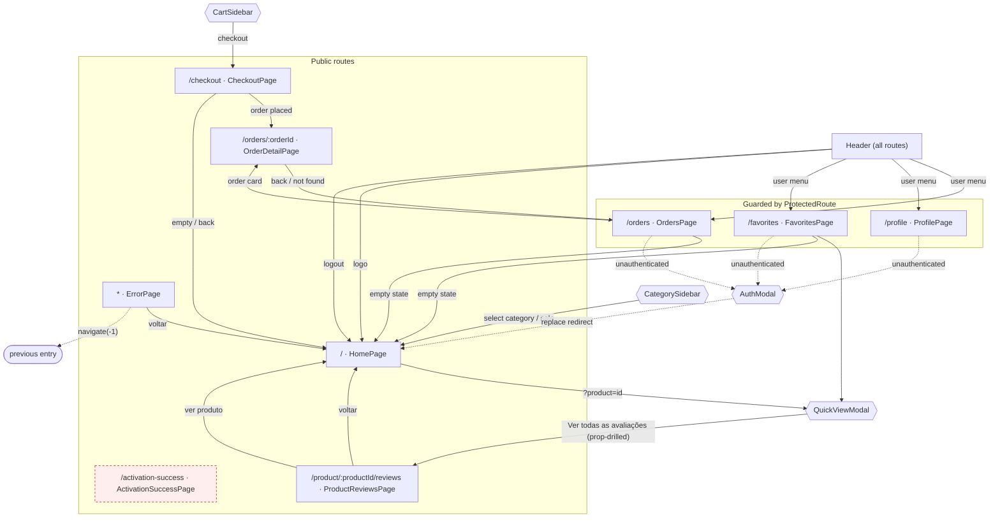

# Navigation Graph — frontend

Verified against `frontend/src` on 2026-09-11. Supersedes the Navigation section of
[application-flow.md](./application-flow.md), which omitted every `<Link>` and `<Navigate>` edge
(it only captured imperative `navigate()` calls).

> **Line numbers below are stale.** They were captured before the `data-testid` attributes were
> added to the frontend, which shifted every subsequent line in the touched files. The analyzer's
> own regenerated output — `application-flow.md` and `testability-manifest.md` — is authoritative
> for current line numbers; this file remains the verification record and the edge inventory.

## Graph

## Edge list

| # | From | To | Trigger | Source |
|---|------|-----|---------|--------|
| 1 | Header | `/` | logo | `components/Header.tsx:85` |
| 2 | Header | `/orders` | user menu › Pedidos | `components/Header.tsx:202` |
| 3 | Header | `/profile` | user menu › Perfil | `components/Header.tsx:213` |
| 4 | Header | `/favorites` | user menu › Favoritos | `components/Header.tsx:224` |
| 5 | Header | `/` | logout | `components/Header.tsx:54` |
| 6 | CategorySidebar | `/` | select category | `App.tsx:76` |
| 7 | CategorySidebar | `/` | select sale | `App.tsx:83` |
| 8 | HomePage | QuickViewModal | `?product=<id>` | `pages/HomePage.tsx:87-96` |
| 9 | QuickViewModal | `/product/:productId/reviews` | "Ver todas as avaliações" — **prop-drilled**: handler in parent, button in child | handler `components/QuickViewModal.tsx:67`, wired via `onViewAll` at `:225`, button `components/ReviewsPopup.tsx:149` |
| 10 | CartSidebar | `/checkout` | finalize purchase | `components/CartSidebar.tsx:19` |
| 11 | CheckoutPage | `/orders/:orderId` | order placed | `pages/CheckoutPage.tsx:242` |
| 12 | CheckoutPage | `/` | empty cart | `pages/CheckoutPage.tsx:262` |
| 13 | CheckoutPage | `/` | back | `pages/CheckoutPage.tsx:279` |
| 14 | OrdersPage | `/orders/:orderId` | order card | `pages/OrdersPage.tsx:55` |
| 15 | OrdersPage | `/` | empty state | `pages/OrdersPage.tsx:45` |
| 16 | OrderDetailPage | `/orders` | back | `pages/OrderDetailPage.tsx:63` |
| 17 | OrderDetailPage | `/orders` | order not found | `pages/OrderDetailPage.tsx:44` |
| 18 | FavoritesPage | `/` | empty state | `pages/FavoritesPage.tsx:51` |
| 19 | FavoritesPage | QuickViewModal | product quick view | via `App.tsx:155` |
| 20 | ProductReviewsPage | `/` | back | `pages/ProductReviewsPage.tsx:105` |
| 21 | ProductReviewsPage | `/?product=<id>` | view product | `pages/ProductReviewsPage.tsx:176` |
| 22 | ActivationSuccessPage | `/` | continue | `pages/ActivationSuccessPage.tsx:96` |
| 23 | ActivationSuccessPage | `/` | auto-redirect | `pages/ActivationSuccessPage.tsx:109` |
| 24 | ErrorPage | `/` | back to home | `pages/ErrorPage.tsx:62` |
| 25 | ErrorPage | `-1` | voltar (history) | `pages/ErrorPage.tsx:50` |
| 26 | ProtectedRoute | `/` | guard, replace | `components/ProtectedRoute.tsx:12` |
| 27 | App | `/` | unauthenticated on `/orders` `/profile` `/favorites`, replace + opens AuthModal | `App.tsx:53-61` |
| 28 | AuthModal | `/activation-success` | *(none — no inbound edge)* | — |

## Findings

**1. `/activation-success` is unreachable.** No `Link`, `navigate()`, or `Navigate` anywhere in
`src/` targets it. It is presumably entered from an external activation e-mail, but the frontend
never links to it and the AuthModal signup/activation flow does not redirect there. Either the
activation flow is not wired up yet, or the route is dead. Note it is in the
`hideCartButtonPages` list (`App.tsx:40`), so it was intended to be reached.

**2. `/orders/:orderId` is not protected, while `/orders` is.** `App.tsx:140` renders
`OrderDetailPage` bare, with no `ProtectedRoute`. The redirect effect at `App.tsx:54` also only
guards exact paths — `protectedPaths.some(path => location.pathname === path)` — so
`/orders/abc123` misses both checks. Any user can open an arbitrary order URL directly. If order
detail should require auth, both the route wrapper and the guard list need updating.

**3. `/` is the universal sink.** 14 of the 28 edges land on the home page — every back button,
every empty state, every guard redirect, and logout. The graph is hub-and-spoke around `/` with a
single cycle, `/` → QuickView → reviews → `/`. No path from a product listing into checkout
preserves which product was being viewed.

**4. Filter state is not in the URL.** `selectedCategory`, `selectedSubcategory`, and
`showOnSale` live in `App.tsx` component state (`App.tsx:35-37`), and the category/sale handlers
call `navigate('/')` to reset. Filters are therefore lost on reload and cannot be linked to. Only
the `?product=<id>` param is URL-backed, and `HomePage.tsx:95` clears it immediately after
opening the modal — so the quick view is not back-button-reachable either.

**5. One edge is prop-drilled, so its trigger cannot be found by ancestor-walking.** Edge 9's
`navigate()` lives in `QuickViewModal` but the button that invokes it lives in `ReviewsPopup`,
reached through the `onViewAll` callback prop. Any analyzer that reports the `navigate()` call site
as the edge origin will find no clickable element there and must emit an unresolved locator rather
than guess. Resolving it properly requires following callback props from a handler into the child
component that receives them — a real limitation to handle explicitly, not silently.

## Doc discrepancies

- **Broken path base.** The Pages section of `application-flow.md` cites sources as `src/App.tsx:NNN`
  — relative to `flow-analyzer/`, which resolves to `flow-analyzer/src/App.tsx` (the analyzer's own
  source), not the frontend. The Navigation section correctly uses `../frontend/src/...`.
- **Line numbers are correct — a correction to an earlier claim.** The Pages entries reference the
  `<Route` *element* line (e.g. `App.tsx:106` for `/`), which is exactly what ts-morph's
  `element.getStartLineNumber()` returns; the `path=` attribute simply sits on the next line. An
  earlier revision of this file called these off by one. That was wrong, and the analyzer was
  reporting them correctly all along.
- **Incomplete by construction — now fixed.** The analyzer matched `navigate(...)` calls only. It
  dropped every JSX `<Link to=...>` (11 edges) and `<Navigate to=...>` (1 edge), and its
  self-closing-element check missed `<Link>` in the common case where the link has children. The
  rewritten `src/analyzers/navigation.ts` handles `JsxSelfClosingElement` and `JsxElement` forms
  plus `Navigate`, taking the count from 13 to 25 router navigations.
